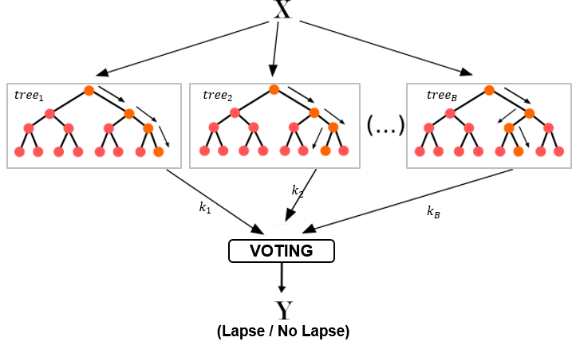

# randomforest

In this project I aimed to predict Inforce Life Insurance Policies whether Lapsed or still Inforce in next 3 months by leveraging policy transaction and customer data. I used Random Forest model in this case to predict the policy status or we can say to predict customers will churn or not in the future.

Random Forest model is an ensemble learning method for classification, regression and other tasks that runs by constructing a multiple of uncorrelated decision trees. The key of the model is the prediction generated by the individual trees need to have low correlations with each other. The more number of the decision trees we use in the model, the bigger the probability of correct predictions we are able to generate. But, of course we should define the threshold, how large the trees that we need to get the correct predictions we desire. If we find that the accuracy (precision and/or recall) is not growing significantly using more number of trees the we should stop. The common way to show the model performance is using Receiver Operating Characteristic (ROC) curve.
